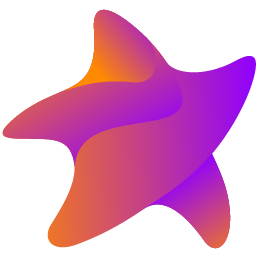

# Stellar

Stellar is a project made by:

- Alberto De Bortoli [@albertodebortoli](https://github.com/albertodebortoli)
- Daniele Margutti [@malcommac](https://github.com/malcommac)
- Pasquale Cerqua [@xl4kj](https://github.com/xl4kj)

They represent the core team behind the project.

The project is in the initial stage and not ready for production.
We hope that open sourcing it will bring more contributions and spark interest in the community.

Logo by [Simone Landoni](http://spaghettidesign.infinityfreeapp.com/?i=1).
